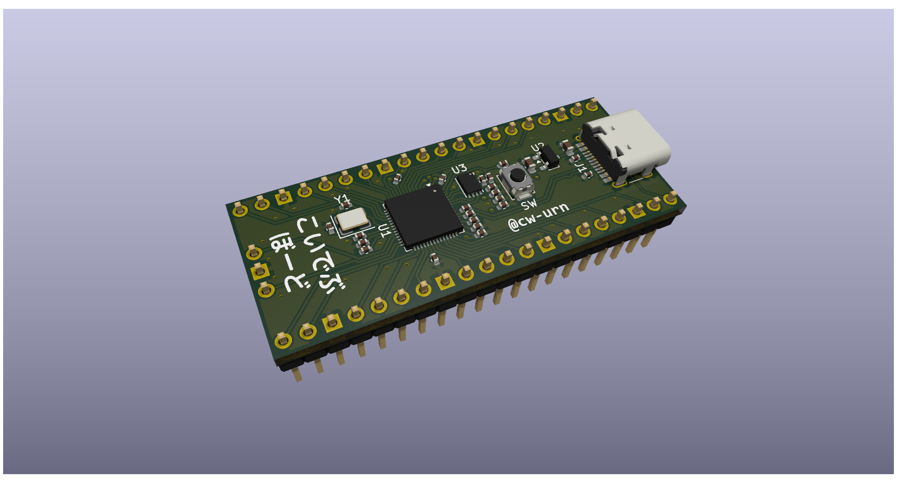
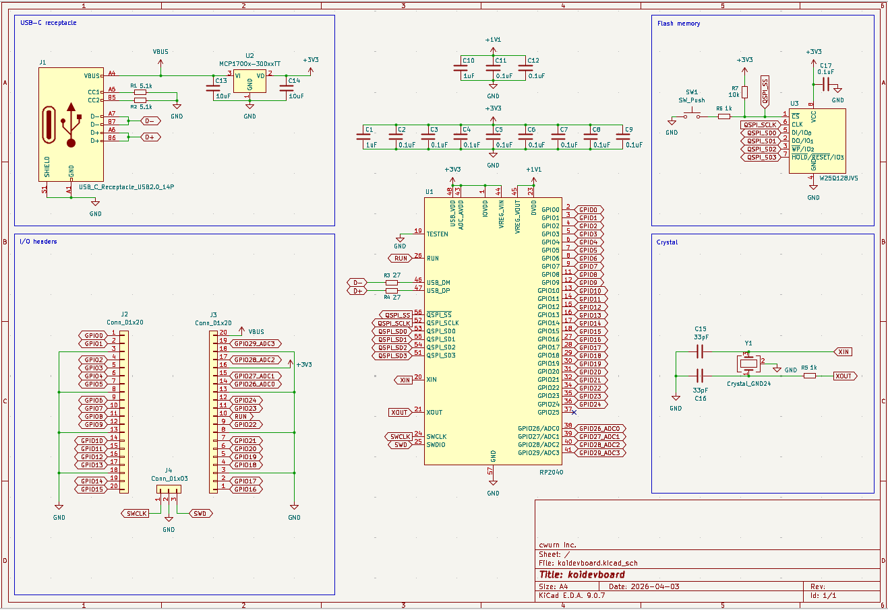
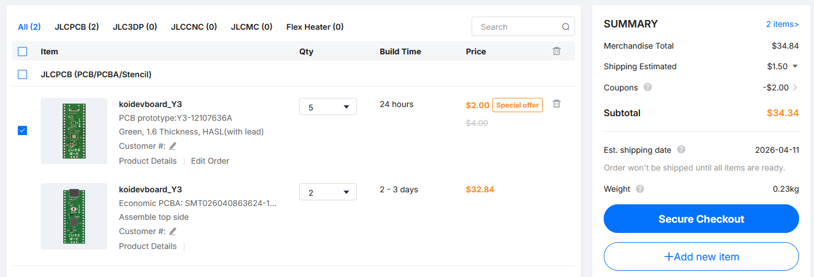

# koidevboard

> What is this?
- koiboard, but the RP2040 development board version.
> How do you use it?
- Everybody knows how to use a devboard...
> Why did I make this?
- Boredom, and I thought it would be interesting and I'd learn from it. I did!

## 3D render

## PCB

### Layer 1

### Layer 2

### Schematic

## JLCPCB cart

